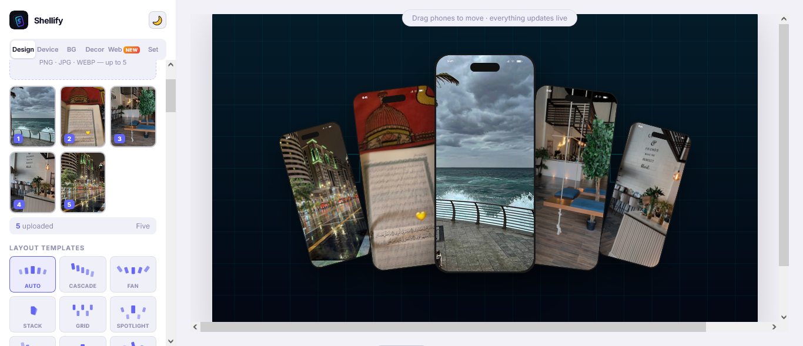
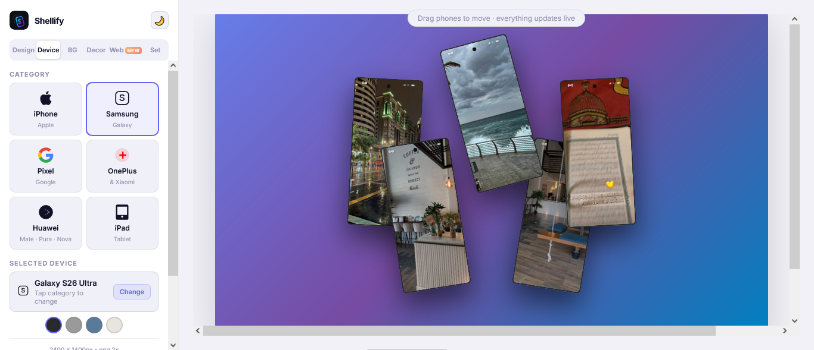
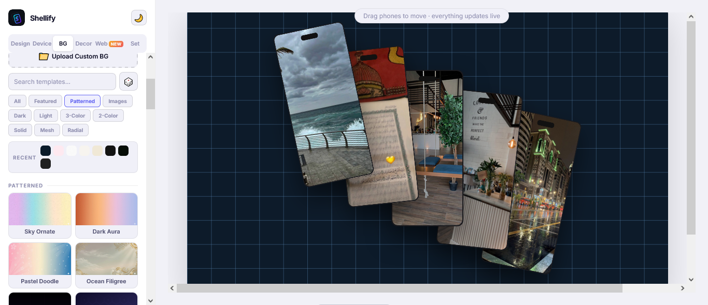

# Shellify — The Premium Mockup Engine

> A professional, browser-based mockup generator — no installation required.


- Built by Claude AI
- Built with Claude Code and the Claude app

---

## Preview Final Project

- Home Screen
- Product Screen
  




---
## What is Shellify?

Shellify is a free, open-source web tool that runs entirely in the browser with no dependencies and no backend. It lets you place your app screenshots inside realistic device frames with professional backgrounds, add decorations and text, and export publication-ready images in seconds — all processing stays 100% client-side, nothing is ever uploaded to a server.

---

## Features

### 📱 Real Device Frames
**55+ devices across 6 categories** with accurate bezel dimensions, Dynamic Island / notch, and realistic shadows:

| Category | Devices |
|----------|---------|
| iPhone | iPhone SE → iPhone 17 Pro Max (19 models) |
| Samsung Galaxy | S23 → S26 Ultra, Z Fold 6, Z Flip 6, Galaxy A55 |
| Google Pixel | Pixel 8, 8 Pro, 9, 9 Pro, 9 Pro XL, 9 Pro Fold |
| OnePlus & Xiaomi | OnePlus 13 / 13R, Xiaomi 14 Ultra, 15, 15 Ultra |
| iPad | iPad Pro 11" & 13" (M4), iPad Air M2, iPad mini 6 |
| **Huawei** *(new)* | Mate 70 / Pro / Pro+ / RS Ultimate, Pura 80 series, Mate XT, Mate X6, Nova 13 / Pro |

🆕 **Authentic device colors** — every model ships with its real official color lineup (e.g. Cosmic Orange, Titanium Black, Desert Titanium, Awesome Lilac) instead of generic frame tints, selectable from a per-device color picker.

---

### 🆕 Smart Layout Templates
One-click layout engine with **9 ready-made arrangements** — Auto, Cascade, Fan, Stack, Grid, Spotlight, Diagonal, Podium, and Orbit — each shown as a live mini-preview and auto-adapted to however many screenshots you've uploaded.

---

### 🎨 Backgrounds & Templates
- **70+ ready-made templates** — curated image backgrounds + gradient presets
- **Color system** in 5 categories: 3-Color, 2-Color, Mesh, Solid, Radial
- 🆕 **Filter bar** — instantly narrow templates by All, Featured, Patterned, Images, Dark, Light, 3-Color, 2-Color, Solid, Mesh, or Radial
- 🆕 **Live search** for templates by name
- 🆕 **Shuffle button** — pick a random template with one click
- 🆕 **Recent colors history** for fast re-access to your last-used palettes
- 🆕 **Custom gradient builder** — pick 3 colors and a direction (diagonal, horizontal, vertical, corner)
- 🆕 **Upload your own background image**
- **Transparent background** export (PNG with alpha channel)
- **Canvas size presets**: Default, Post, Square, Story, HD, Full HD, plus 🆕 **App Store 6.5″**, **App Store 6.7″**, **Google Play**, **X (Twitter) Header**, and **OG Image / Profile**
- 🆕 **Aspect ratio lock** and a one-click **Portrait/Landscape swap**

---

### 🌐 Website Preview (Web Tab)
- Enter any website URL to generate a website mockup automatically
- **10 frame styles**: Browser Window, MacBook, Desktop Monitor, Mobile Phone, Tablet, and 🆕 combined multi-device frames — Multi, PC + Tablet, PC + Phone, Laptop + Phone, and Responsive
- 🆕 **Frame color customization** — quick presets (Black, Silver, Gold) or a custom color picker
- Choose a background gradient behind the frame
- Download the result or add it directly to the main stage

---

### 🖼️ Multi-Image Support
- Upload up to **5 screenshots** at once
- Drag & drop to **reorder** them
- Auto-arranged in a balanced, depth-based layout
- Manually **drag each phone** anywhere on the canvas

---

### ⚙️ Layout Controls
- **Spacing** — control the gap between devices
- **Phone Scale** — resize all devices proportionally
- **Overlap** — layer devices over each other
- **Rotation** — tilt all devices
- **Auto toggles**: Auto Rotation, Auto Scale, Auto Spacing, Auto Overlap
- **Reset button** — restore all layout values to default

---

### 🎛️ Per-Phone Control
Each uploaded image gets its own control panel:

- **Z-Index** — control which phone appears on top
- **Scale** — resize this phone independently
- **Rotation** — tilt this phone individually
- **Offset X / Y** — shift this phone horizontally or vertically
- **Reset** — restore this phone to its default position

---

### ✨ SVG Decorations
- **50 recolorable SVG decorations** — stars & sparkles, moons & suns, clouds, hearts & flowers, geometric shapes, lines & waves, celestial elements (orbits, comets, planets), arrows, dot textures, and decorative frames
- Pick any color with the color picker
- Control **size, opacity, rotation** independently per decoration
- Drag decorations freely on the canvas
- 🆕 **Duplicate** any decoration in one click
- 🆕 **Flip horizontal / vertical**
- 🆕 **Bring forward / send backward** layer ordering
- Delete a single item or clear all decorations at once
- All decorations are **exported in the final image**

---

### 🖊️ Text Overlay
- Add text directly on the mockup (up to 160 characters)
- Control **font size, weight, color, alignment, and position** (top / center / bottom)
- 🆕 **Text shadow** with adjustable color and blur strength
- 🆕 **Text stroke/outline** with adjustable color and width
- 🆕 **Text background box** with its own color, opacity, and padding
- Live preview updates instantly

---

### 🖼️ Device Customization
- **Device Shadow** — toggle on/off, choose shadow color and opacity
- **Dynamic Island / Notch** — toggle visibility
- 🆕 **Status Bar** — show time, signal, and battery, with an optional fully-transparent style
- 🆕 **Reflection effect** — a mirrored fade beneath the device, with adjustable opacity and height

---

### 🆕 Project Save & Load
Export your entire project (images, devices, background, text, decorations, and every setting) to a single JSON file, and re-import it later to pick up exactly where you left off.

---

### 🆕 Undo / Redo & Shortcuts
- Full undo/redo history — `Ctrl+Z` to undo, `Ctrl+Y` (or `Ctrl+Shift+Z`) to redo
- `Ctrl+D` quick-download shortcut
- Granular reset menu — Clear Images only, Clear Decorations only, Clear Text only, or Reset All

---

### 💾 Export Options
| Option | Values |
|--------|--------|
| Format | PNG, JPG, WEBP |
| Quality | HD (1x), 2x, 3x |
| Watermark | Optional Shellify badge toggle |
| 🆕 Export History | Live counter of images downloaded this session |

---

### 🌍 Multilingual Interface
- 🇺🇸 English
- 🇸🇦 Arabic (RTL)
- 🇫🇷 Français
- 🇩🇪 Deutsch
- 🇪🇸 Español

---

### 🆕 Privacy & Security
Built-in **Privacy Policy** and **Security** info panels explaining that every image and edit is processed locally in the browser and never sent to a server.

---

### ⚙️ Settings & Persistence
- All settings auto-saved to `localStorage`
- Dark / Light theme
- Export format and quality remembered between sessions
- Partial reset options: Clear Images only, Clear Decorations only, Clear Text only, or Reset All

---

## Getting Started

```bash
git clone https://github.com/your-username/shellify.git
cd shellify
```

Then open `index.html` in any modern browser. That's it.

> **Important:** All files must be in the same folder. For the image-based background templates to load correctly, serve the project through a local server (e.g. VS Code's Live Server) instead of opening `index.html` directly from disk.

```
shellify/
├── index.html                  # Page structure
├── style.css                   # All styles
├── script.js                   # All logic
└── assets/images/bg-images.js  # Background image library
```

---

## How to Use

```
1. Open index.html in your browser
2. Go to Design tab → upload your app screenshots
3. Pick a Layout Template, or arrange phones manually
4. Go to Device tab → choose your device model and color
5. Go to BG tab → pick a template, gradient, or your own image
6. Optionally add decorations, text overlay, or adjust effects
7. Press Download → done
```

For a website mockup:
```
1. Go to Web tab
2. Enter a URL (e.g. https://yoursite.com)
3. Choose a frame style (Browser, MacBook, Desktop, Mobile, Tablet, Multi...)
4. Pick a frame color
5. Download or Add to Stage
```

---

## Tech Stack

| Technology | Purpose |
|------------|---------|
| HTML5 Canvas | Device rendering & image export |
| Vanilla JavaScript | All logic — zero dependencies |
| SVG | Decorations & device icons |
| CSS Variables | Dark/light theming |
| localStorage | Settings & auto-save persistence |
| Web APIs only | No backend, no server |

---

## Browser Support

| Browser | Support |
|---------|---------|
| Chrome / Edge | ✅ Full |
| Firefox | ✅ Full |
| Safari | ✅ Full |
| Mobile browsers | ✅ Supported |

---

## License

MIT License — free to use, modify, and distribute.

---

## Author

Built with ❤️ using pure HTML, CSS, and JavaScript.
No frameworks. No build tools. No dependencies.

---

*Shellify — From screenshot to mockup in seconds.*
